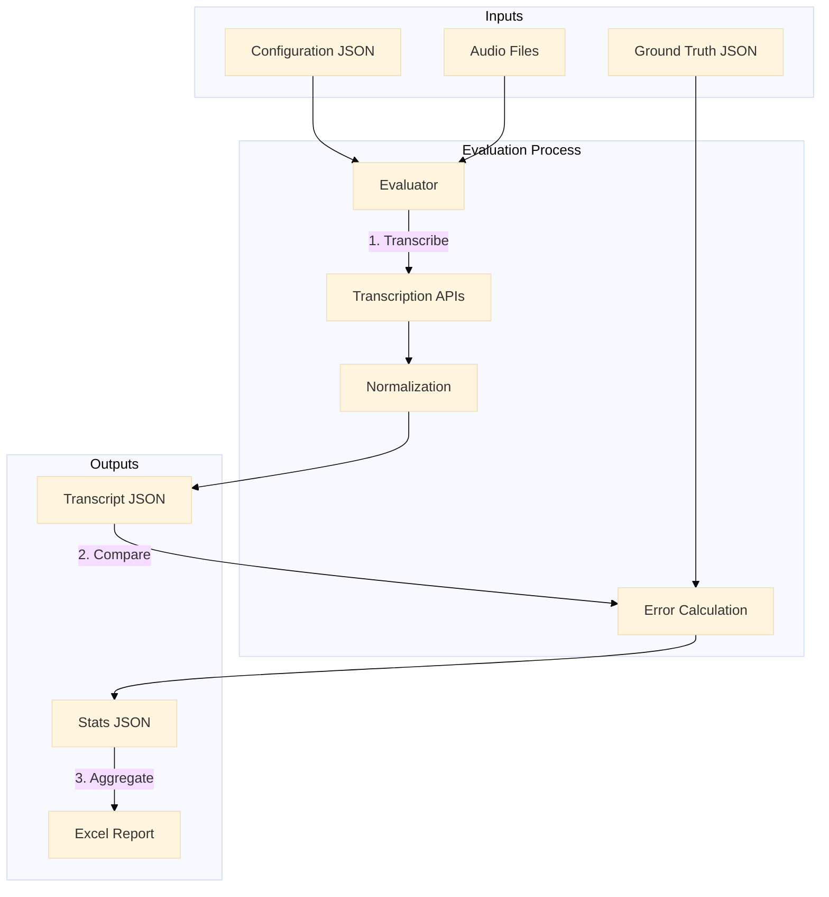

# Transcription Evals

A framework for evaluating audio transcription models (STT/ASR) accuracy and performance. This project allows for systematic comparison of different Speech-to-Text services against ground truth datasets.

## Features

- **Multi-Provider Support**: Currently supports integrations with:
  - Deepgram
  - AssemblyAI
- **Configurable Evaluations**: Define experiments using JSON configuration files.
- **Compare Model Configurations**: Evaluate the same model with different options (e.g., prompting vs. no prompting) in a single run using labels.
- **Preprocessing Tools**: Utilities to normalize audio formats and transcript structures.
- **Detailed Reporting**: Generates intermediate transcriptions and final evaluation comparisons.

## Workflow



## Project Structure

- `src/evaluator/`: The core application for running evaluations.
  - Contains the main runner (`main.py`) and transcriber implementations.
- `src/preprocessors/`: Helper scripts for data preparation.
  - `podcast_transcript_to_json.py`: Convert diverse transcript formats to the standard JSON structure.
  - `reencode_mp3_16k_mono.py`: Standardize audio files.
- `experiments/`: Configuration files and datasets for running evaluations.

## Getting Started

### Prerequisites

- [uv](https://github.com/astral-sh/uv) - Fast Python package installer and resolver.
- API Keys for the transcription services you intend to use (e.g., `DEEPGRAM_API_KEY`, `ASSEMBLYAI_API_KEY`).

### Installation

1.  Clone the repository.
2.  Navigate to the evaluator directory:
    ```bash
    cd src/evaluator
    ```
3.  Install dependencies:
    ```bash
    uv sync
    ```

### Usage

1.  **Set up your environment variables**:
    Copy the sample environment file and add your API keys:
    ```bash
    cp .env.example .env
    # Edit .env and add your DEEPGRAM_API_KEY / ASSEMBLYAI_API_KEY
    ```

2.  **Prepare your data**:
    Place audio files and ground truth transcripts in the `experiments/datasets` directory structure.
    > The included `experiments/datasets/podcasts` folder serves as a complete example project reference.

3.  **Configure an experiment**:
    Create a configuration file that points to your data and selects the models to test.
    > You can use `experiments/podcasts.json` as a reference template for your own experiments.

4.  **Run the evaluator**:
    ```bash
    cd src/evaluator
    uv run main.py ../../experiments/podcasts.json
    ```

### Command Line Arguments

The evaluator tool supports the following arguments:

- **`config_file`** (positional):
  Path to the JSON configuration file defining the experiment.
- **`--lazy-transcription`**:
  Optional flag. When set, the evaluator checks if a transcript output file already exists for the specific combination of **model**, **label**, and **audio file**. If the file exists, transcription is skipped.
  This allows you to evaluate multiple configurations of the same model (e.g., using different `label`s) within the same project without re-processing already transcribed files, saving significant time and API costs.

## Configuration File Format

The experiment configuration is a JSON file that defines input data, models to test, and output locations. Below is a detailed breakdown using `experiments/podcasts.json` as a reference.

```json
{
  "inputs": [
    {
      "audio": "sample-01.mp3",
      "transcript": "sample-01.json"
    }
  ],
  "models": [
    {
      "name": "Deepgram",
      "label": "nova-3",
      "options": {
        "model": "nova-3"
      }
    }
  ],
  "paths": {
    "inputs": "./datasets/podcasts/inputs",
    "outputs": "./evals/",
    "excel-report-template": "./templates/experiments-report-template.xlsx"
  }
}
```

### Fields Description

- **`inputs`** (Required): A list of test cases.
  - `audio` (Required): Filename of the audio file to transcribe. Must exist in the directory specified by `paths.inputs`.
  - `transcript` (Required): Filename of the ground truth transcript JSON. Used for calculating Word Error Rate (WER). Must exist in `paths.inputs`.

- **`models`** (Required): A list of transcription services to evaluate.
  - `name` (Required): The provider name. Currently supports: `"Deepgram"`, `"AssemblyAI"`.
  - `label` (Optional): A custom label (e.g., `"v3"`) appended to output filenames to distinguish experimental runs.
  - `options` (Optional): A dictionary of parameters passed directly to the provider's API (e.g., model selection, prompting).

- **`paths`** (Required): Directory configuration. **Start all paths with `./` or `../` relative to the location of this JSON configuration file.**
  - `inputs` (Required): Base directory containing the audio and transcript files.
  - `outputs` (Required): Directory where results (intermediate JSONs, stats, reports) will be saved.
  - `excel-report-template` (Optional): Path to a custom Excel template for report generation.

## Development

The project is built with Python and uses `uv` for dependency management.

- **Linting**:
  ```bash
  cd src/evaluator
  uv run pylint --disable=C0301 .
  ```

- **Testing**:
  ```bash
  cd src/evaluator
  uv run pytest
  ```

## License

This project is licensed under the MIT License - see the [LICENSE](LICENSE) file for details.
