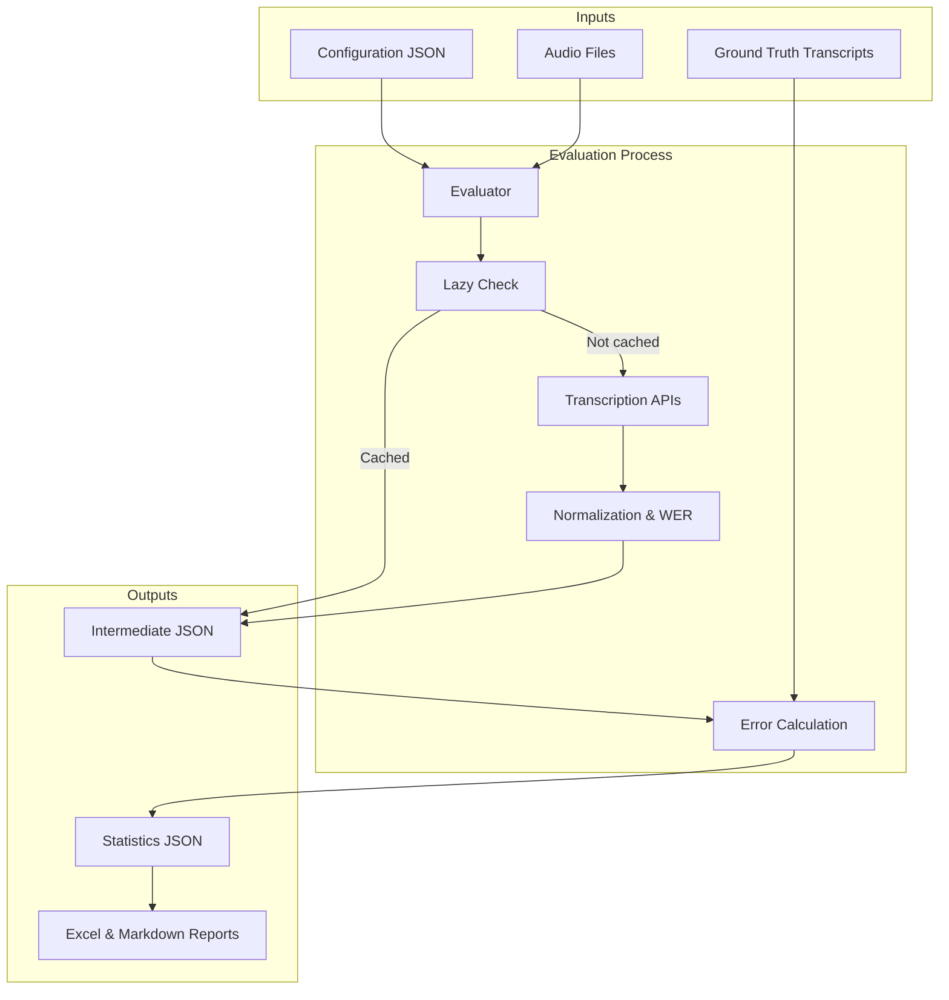

# Transcription Evals

A comprehensive framework for evaluating audio transcription models (Speech-to-Text/ASR). This project enables systematic comparison of different transcription services against ground truth datasets with automated error calculation, performance metrics, and detailed reporting.

## Features

- **Multi-Provider Support**: Integrate with multiple transcription services:
  - ✅ [Deepgram](https://deepgram.com/)
  - ✅ [AssemblyAI](https://www.assemblyai.com/)
  - ⌛ [AWS Transcribe](https://aws.amazon.com/transcribe/) (pending implementation)
  - ⌛ [Google Speech-to-Text](https://cloud.google.com/speech-to-text) (pending implementation)
  - ⌛ [Mistral VoxtralAI](https://mistral.ai/) (pending implementation)

- **Lazy Transcription**: Skip re-transcribing files that already have results, saving time and API costs
- **Configurable Evaluations**: Define experiments using JSON configuration files with flexible model options
- **Model Configuration Labels**: Compare the same model with different options (e.g., different model variants, prompting strategies) in a single run
- **Automatic Error Metrics**: Calculates Word Error Rate (WER) and normalizes transcripts
- **Preprocessing Tools**: Convert diverse audio formats and transcript structures to standard formats
- **Rich TUI**: Interactive terminal interface with progress tracking and real-time logging
- **Multi-Format Reporting**: Generate Excel comparisons and Markdown summaries

## Workflow

The evaluator processes audio files through transcription services, normalizes the output, and compares results against ground truth:



## Project Structure

```
transcription-evals/
├── src/
│   ├── evaluator/              # Main application
│   │   ├── main.py            # CLI entry point with Rich TUI
│   │   ├── evaluation_runner.py    # Core evaluation orchestrator
│   │   ├── report_generators/     # Report generation modules
│   │   ├── transcribers/          # Provider implementations
│   │   │   ├── abstract_transcriber.py
│   │   │   ├── deepgram.py
│   │   │   ├── assembly_ai.py
│   │   │   ├── aws_transcribe.py
│   │   │   ├── google_speech_to_text.py
│   │   │   └── mistral_voxtral.py
│   │   ├── tests/              # Unit tests
│   │   └── pyproject.toml
│   └── preprocessors/           # Data preparation utilities
│       ├── podcast_transcript_to_json.py
│       └── reencode_mp3_16k_mono.py
├── experiments/                 # Sample datasets and configs
│   ├── podcasts.json           # Example configuration
│   ├── datasets/
│   │   └── podcasts/           # Sample audio and ground truth
│   └── evals/                  # Evaluation outputs
└── LICENSE
```

## Getting Started

### Prerequisites

- **Python 3.13+**
- **[uv](https://github.com/astral-sh/uv)** - Fast Python package installer and resolver
- **API Keys** for the transcription services you intend to evaluate:
  - `DEEPGRAM_API_KEY` - [Get Deepgram key](https://console.deepgram.com/)
  - `ASSEMBLYAI_API_KEY` - [Get AssemblyAI key](https://www.assemblyai.com/)
  - `AWS_ACCESS_KEY_ID`, `AWS_SECRET_ACCESS_KEY` - [Configure AWS credentials](https://docs.aws.amazon.com/cli/latest/userguide/cli-configure-quickstart.html)
  - `GOOGLE_APPLICATION_CREDENTIALS` - [Set up Google Cloud](https://cloud.google.com/speech-to-text/docs/before-you-begin)
  - `MISTRAL_API_KEY` - [Get Mistral key](https://console.mistral.ai/api-keys/)

### Installation

1. Clone the repository:
   ```bash
   git clone https://github.com/ytkaczyk/transcription-evals.git
   cd transcription-evals
   ```

2. Navigate to the evaluator directory:
   ```bash
   cd src/evaluator
   ```

3. Install dependencies using `uv`:
   ```bash
   uv sync
   ```

### Usage

1. **Configure your environment variables**:
   ```bash
   # Create .env file in src/evaluator directory
   cp .env.example .env
   
   # Add your API keys to .env
   DEEPGRAM_API_KEY=your_key_here
   ASSEMBLYAI_API_KEY=your_key_here
   # ... add other provider keys as needed
   ```

2. **Prepare your dataset**:
   - Place audio files in `experiments/datasets/your-dataset/inputs/`
   - Place corresponding ground truth transcripts in the same directory
   - See `experiments/datasets/podcasts/` for the complete example structure

3. **Create a configuration file**:
   ```bash
   # Use experiments/podcasts.json as a template
   # Specify which models to evaluate and their options
   ```

4. **Run the evaluator**:
   ```bash
   cd src/evaluator
   uv run main.py ../../experiments/podcasts.json
   ```

5. **View results**:
   - Intermediate transcripts: `experiments/evals/podcasts/intermediate/`
   - Statistics: `experiments/evals/podcasts/outputs/`
   - Reports: Excel and Markdown summaries in the outputs directory

### Command Line Options

```bash
uv run main.py CONFIG_FILE [--lazy-transcription]
```

- **`CONFIG_FILE`** (positional, required): Path to the JSON configuration file
- **`--lazy-transcription`** (optional flag): Skip transcription if output files already exist
  - Useful for evaluating the same model with different configurations
  - Significantly reduces API costs and runtime

## Configuration File Format

The experiment configuration is a JSON file that defines your evaluation setup. Here's the structure using `experiments/podcasts.json` as a reference:

```json
{
  "inputs": [
    {
      "audio": "sample-01.mp3",
      "transcript": "sample-01.json"
    },
    {
      "audio": "sample-02.mp3",
      "transcript": "sample-02.json"
    }
  ],
  "models": [
    {
      "name": "Deepgram",
      "label": "nova-3",
      "options": {
        "model": "nova-3"
      }
    },
    {
      "name": "AssemblyAI",
      "label": "default"
    }
  ],
  "paths": {
    "inputs": "./datasets/podcasts/inputs",
    "outputs": "./evals/",
    "excel-report-template": "./templates/experiments-report-template.xlsx"
  }
}
```

### Configuration Fields

- **`inputs`** (Required): Array of test cases
  - `audio`: Audio file name (must exist in `paths.inputs`)
  - `transcript`: Ground truth transcript JSON file (used for WER calculation)

- **`models`** (Required): Array of transcription providers to evaluate
  - `name`: Provider name (`"Deepgram"`, `"AssemblyAI"`, `"AwsTranscribe"`, `"GoogleSpeechToText"`, `"MistralVoxtral"`)
  - `label` (Optional): Custom identifier appended to output filenames (e.g., `"nova-3"`)
  - `options` (Optional): Provider-specific parameters (model selection, language, etc.)

- **`paths`** (Required): Directory configuration (use relative paths from the configuration file)
  - `inputs`: Directory containing audio and transcript files
  - `outputs`: Directory for saving results
  - `excel-report-template` (Optional): Custom Excel template for reports

## Supported Transcription Providers

### Deepgram
```json
{
  "name": "Deepgram",
  "label": "nova-3",
  "options": {
    "model": "nova-3",
    "language": "en"
  }
}
```
- Model options: `nova-3`, `nova-2`, `enhanced`, `base`

### AssemblyAI
```json
{
  "name": "AssemblyAI",
  "label": "default"
}
```

### AWS Transcribe
```json
{
  "name": "AwsTranscribe",
  "label": "default",
  "options": {
    "language_code": "en-US"
  }
}
```

### Google Speech-to-Text
```json
{
  "name": "GoogleSpeechToText",
  "label": "default"
}
```

### Mistral VoxtralAI
```json
{
  "name": "MistralVoxtral",
  "label": "default"
}
```

## Development

### Setup

1. Install `uv` from [https://github.com/astral-sh/uv](https://github.com/astral-sh/uv)
2. Navigate to the evaluator directory:
   ```bash
   cd src/evaluator
   ```
3. Install dependencies:
   ```bash
   uv sync
   ```

### Running Tests

```bash
cd src/evaluator
uv run pytest
```

Tests include:
- Transcriber implementations and API integration
- Error calculation and normalization logic
- Report generation
- Configuration parsing

### Linting & Type Checking

```bash
cd src/evaluator

# Linting
uv run pylint --disable=C0301 .

# Type checking
uv run pyright
```

### Verification

Run the complete verification suite (tests, linting, type checks):

```bash
cd src/evaluator
uv run scripts/verify.py
```

## Architecture Patterns

### Transcriber Interface

All transcription providers must implement the `AbstractTranscriber` interface:

```python
from transcribers.abstract_transcriber import AbstractTranscriber
from transcribers.types import TranscriptResult, ConversationItem

class MyTranscriber(AbstractTranscriber):
    @property
    def name(self) -> str:
        """Human-readable provider name"""
        return "My Provider"
    
    def transcribe(self, audio_file_path: str) -> TranscriptResult:
        """Transcribe audio and return normalized result"""
        # Implementation details
        items = [ConversationItem(speaker="Speaker", text="Transcribed text", start_time="00:00:00", end_time="00:00:05")]
        return TranscriptResult(name=self.name, conversation=items)
```

### Data Standards

All transcribers must output normalized to the `TranscriptResult` type:
- `name`: Provider name
- `conversation`: List of `ConversationItem` objects with:
  - `speaker`: Speaker identifier
  - `text`: Transcribed text
  - `start_time`: Timestamp in `"HH:MM:SS"` format
  - `end_time`: Timestamp in `"HH:MM:SS"` format

See [src/evaluator/transcribers/types.py](src/evaluator/transcribers/types.py) for complete type definitions.

### Dependency Management

This project uses `uv` for reproducible Python package management:

```bash
# Install a new package
uv add package_name

# Install a dev package
uv add --dev package_name

# Update dependencies
uv sync
```

## Reporting

The evaluator automatically generates multiple report formats:

- **Intermediate Files**: Raw transcriptions from each provider saved as JSON
- **Statistics JSON**: WER calculations and error metrics for each model/file combination
- **Excel Report**: Comparative table across all models (if template provided)
- **Markdown Summary**: Human-readable evaluation summary

## Troubleshooting

### API Key Issues
- Ensure `.env` file exists in `src/evaluator/` with correct environment variable names
- Check that API keys have appropriate permissions for each service
- Verify API keys haven't exceeded rate limits

### Audio Format Issues
- Use `src/preprocessors/reencode_mp3_16k_mono.py` to standardize audio files
- Most providers expect MP3 or WAV format in mono, 16kHz sample rate
- Verify audio files are valid and not corrupted

### Transcription Failures
- Check provider dashboards for quota limits or failures
- Review error logs in `experiments/logs/` directory
- Verify network connectivity to provider APIs
- Run with a single model/file combination to isolate issues

## License

This project is licensed under the MIT License - see the [LICENSE](LICENSE) file for details.
