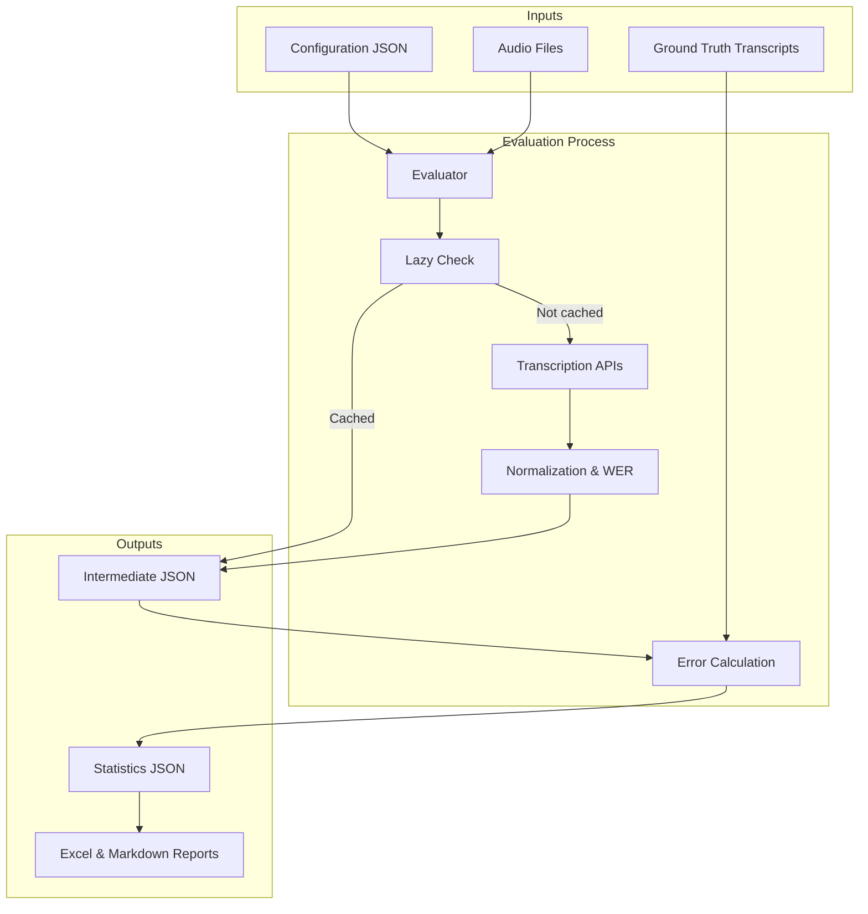

# Transcription Evals

A comprehensive framework for evaluating audio transcription models (Speech-to-Text/ASR). This project enables systematic comparison of different transcription services against ground truth datasets with automated error calculation, performance metrics, and detailed reporting.

## Features

- **Multi-Provider Support**: Integrate with multiple transcription services:
  - ✅ [Deepgram](https://deepgram.com/)
  - ✅ [AssemblyAI](https://www.assemblyai.com/)
  - ✅ [AWS Transcribe](https://aws.amazon.com/transcribe/)
  - ✅ [Voxtral](https://mistral.ai/)

- **Lazy Transcription**: Skip re-transcribing files that already have results, saving time and API costs
- **Configurable Evaluations**: Define experiments using JSON configuration files with flexible model options
- **Model Configuration Labels**: Compare the same model with different options (e.g., different model variants, prompting strategies) in a single run
- **Automatic Error Metrics**: Calculates Word Error Rate (WER) and normalizes transcripts
- **Preprocessing Tools**: Convert diverse audio formats and transcript structures to standard formats
- **Rich TUI**: Interactive terminal interface with progress tracking and real-time logging
- **Multi-Format Reporting**: Generate Excel comparisons and Markdown summaries

## Workflow

The evaluator processes audio files through transcription services, normalizes the output, and compares results against ground truth:



## Project Structure

```
transcription-evals/
├── src/
│   ├── evaluator/              # Main application
│   │   ├── main.py            # CLI entry point with Rich TUI
│   │   ├── evaluation_runner.py    # Core evaluation orchestrator
│   │   ├── report_generators/     # Report generation modules
│   │   ├── transcribers/          # Provider implementations
│   │   │   ├── abstract_transcriber.py
│   │   │   ├── deepgram.py
│   │   │   ├── assembly_ai.py
│   │   │   ├── aws_transcribe.py
│   │   │   └── mistral_voxtral.py
│   │   ├── tests/              # Unit tests
│   │   └── pyproject.toml
│   └── preprocessors/           # Data preparation utilities
│       ├── podcast_transcript_to_json.py
│       └── reencode_mp3_16k_mono.py
├── experiments/                 # Sample datasets and configs
│   ├── podcasts.json           # Example configuration
│   ├── datasets/
│   │   └── podcasts/           # Sample audio and ground truth
│   └── evals/                  # Evaluation outputs
└── LICENSE
```

## Getting Started

### Prerequisites

- **Python 3.13+**
- **[uv](https://github.com/astral-sh/uv)** - Fast Python package installer and resolver
- **API Keys** for the transcription services you intend to evaluate:
  - `DEEPGRAM_API_KEY` - [Get Deepgram key](https://console.deepgram.com/)
  - `ASSEMBLYAI_API_KEY` - [Get AssemblyAI key](https://www.assemblyai.com/)
  - `AWS_ACCESS_KEY_ID`, `AWS_SECRET_ACCESS_KEY`, `AWS_DEFAULT_REGION`, `AWS_S3_BUCKET` - [Configure AWS credentials](https://docs.aws.amazon.com/cli/latest/userguide/cli-configure-quickstart.html)
  - `MISTRAL_API_KEY` - [Get Mistral key](https://console.mistral.ai/api-keys/)

### Installation

1. Clone the repository:
   ```bash
   git clone https://github.com/ytkaczyk/transcription-evals.git
   cd transcription-evals
   ```

2. Navigate to the evaluator directory:
   ```bash
   cd src/evaluator
   ```

3. Install dependencies using `uv`:
   ```bash
   uv sync
   ```

### Usage

1. **Configure your environment variables**:
   ```bash
   # Create .env file in src/evaluator directory
   cp .env.example .env
   
   # Add your API keys to .env
   DEEPGRAM_API_KEY=your_key_here
   ASSEMBLYAI_API_KEY=your_key_here
   MISTRAL_API_KEY=your_key_here
   AWS_ACCESS_KEY_ID=your_key_here
   AWS_SECRET_ACCESS_KEY=your_secret_here
   AWS_DEFAULT_REGION=us-east-1
   AWS_S3_BUCKET=your-s3-bucket-name
   # ... add other provider keys as needed
   ```

2. **Prepare your dataset**:
   - Place audio files in `experiments/datasets/your-dataset/inputs/`
   - Place corresponding ground truth transcripts in the same directory
   - See `experiments/datasets/podcasts/` for the complete example structure

3. **Create a configuration file**:
   ```bash
   # Use experiments/podcasts.json as a template
   # Specify which models to evaluate and their options
   ```

4. **Run the evaluator**:
   ```bash
   cd src/evaluator
   uv run main.py ../../experiments/podcasts.json
   ```

5. **View results**:
   - Intermediate transcripts: `experiments/evals/podcasts/intermediate/`
   - Statistics: `experiments/evals/podcasts/outputs/`
   - Reports: Excel and Markdown summaries in the outputs directory

### Command Line Options

```bash
uv run main.py CONFIG_FILE [--lazy-transcription]
```

- **`CONFIG_FILE`** (positional, required): Path to the JSON configuration file
- **`--lazy-transcription`** (optional flag): Skip transcription if output files already exist
  - Useful for evaluating the same model with different configurations
  - Significantly reduces API costs and runtime

## Configuration File Format

The experiment configuration is a JSON file that defines your evaluation setup. Here's the structure using `experiments/podcasts.json` as a reference:

```json
{
  "inputs": [
    {
      "audio": "sample-01.mp3",
      "transcript": "sample-01.json"
    },
    {
      "audio": "sample-02.mp3",
      "transcript": "sample-02.json"
    }
  ],
  "models": [
    {
      "name": "Deepgram",
      "label": "nova-3",
      "options": {
        "model": "nova-3"
      }
    },
    {
      "name": "AssemblyAI",
      "label": "default"
    }
  ],
  "paths": {
    "inputs": "./datasets/podcasts/inputs",
    "outputs": "./evals/",
    "excel-report-template": "./templates/experiments-report-template.xlsx"
  }
}
```

### Configuration Fields

- **`inputs`** (Required): Array of test cases
  - `audio`: Audio file name (must exist in `paths.inputs`)
  - `transcript`: Ground truth transcript JSON file (used for WER calculation)

- **`models`** (Required): Array of transcription providers to evaluate
  - `name`: Provider name (`"Deepgram"`, `"AssemblyAI"`, `"AwsTranscribe"`, `"MistralVoxtral"`)
  - `label` (Optional): Custom identifier appended to output filenames (e.g., `"nova-3"`)
  - `options` (Optional): Provider-specific parameters (model selection, language, etc.)

- **`paths`** (Required): Directory configuration (use relative paths from the configuration file)
  - `inputs`: Directory containing audio and transcript files
  - `outputs`: Directory for saving results
  - `excel-report-template` (Optional): Custom Excel template for reports

## Supported Transcription Providers

### Deepgram
```json
{
  "name": "Deepgram",
  "label": "nova-3",
  "options": {
    "model": "nova-3",
    "language": "en"
  }
}
```
- Model options: `nova-3`, `nova-2`, `enhanced`, `base`

### AssemblyAI
```json
{
  "name": "AssemblyAI",
  "label": "default"
}
```

### AWS Transcribe
```json
{
  "name": "AwsTranscribe",
  "label": "default",
  "options": {
    "language_code": "en-US"
  }
}
```

### Voxtral
```json
{
  "name": "Voxtral",
  "label": "default"
}
```

## Development

### Setup

1. Install `uv` from [https://github.com/astral-sh/uv](https://github.com/astral-sh/uv)
2. Navigate to the evaluator directory:
   ```bash
   cd src/evaluator
   ```
3. Install dependencies:
   ```bash
   uv sync
   ```

### Running Tests

```bash
cd src/evaluator
uv run pytest
```

Tests include:
- Transcriber implementations and API integration
- Error calculation and normalization logic
- Report generation
- Configuration parsing

### Linting & Type Checking

```bash
cd src/evaluator

# Linting
uv run pylint --disable=C0301 .

# Type checking
uv run pyright
```

### Verification

Run the complete verification suite (tests, linting, type checks):

```bash
cd src/evaluator
uv run scripts/verify.py
```

## Architecture Patterns

### Transcriber Interface

All transcription providers must implement the `AbstractTranscriber` interface:

```python
from transcribers.abstract_transcriber import AbstractTranscriber
from transcribers.types import TranscriptResult, ConversationItem

class MyTranscriber(AbstractTranscriber):
    @property
    def name(self) -> str:
        """Human-readable provider name"""
        return "My Provider"
    
    def transcribe(self, audio_file_path: str, options: Optional[Dict[str, Any]] = None) -> TranscriptResult:
        """Transcribe audio and return normalized result"""
        # Implementation details
        items = [ConversationItem(timestamp="00:00:00", person="Speaker", content="Transcribed text")]
        return TranscriptResult(name=self.name, conversation=items)
```

### Data Standards

All transcribers must output normalized to the `TranscriptResult` type:
- `name`: Provider name
- `conversation`: List of `ConversationItem` objects with:
  - `timestamp`: Timestamp in `"HH:MM:SS"` format
  - `person`: Speaker identifier
  - `content`: Transcribed text

See [src/evaluator/transcribers/types.py](src/evaluator/transcribers/types.py) for complete type definitions.

### Dependency Management

This project uses `uv` for reproducible Python package management:

```bash
# Install a new package
uv add package_name

# Install a dev package
uv add --dev package_name

# Update dependencies
uv sync
```

## Methodology

All error metrics are computed using [JiWER](https://jitsi.github.io/jiwer/), a standard Python library for ASR evaluation. Metrics are calculated by aligning the **hypothesis** (model output) against the **reference** (ground truth) after applying a text transformation pipeline to both strings.

### Metrics

| Metric | Full Name | What it measures |
|---|---|---|
| **WER** | Word Error Rate | Proportion of words that must be inserted, deleted, or substituted to match the reference. The primary industry-standard metric for ASR quality. |
| **MER** | Match Error Rate | Proportion of reference words that are not matched correctly; less sensitive than WER to transcript-length differences. |
| **WIL** | Word Information Lost | Fraction of word information from the reference that is not conveyed by the hypothesis. |
| **CER** | Character Error Rate | Same alignment principle as WER but applied at the character level; useful for agglutinative language content or when word-boundary conventions differ between providers. |

Each metric is reported in two variants: **standard** and **normalized**.

---

### Standard metrics (`wer`, `mer`, `wil`, `cer`)

Standard metrics use JiWER's built-in `wer_default` transformation pipeline, which performs only minimal pre-processing to prepare the text for alignment without altering its linguistic content:

| Transform | Effect |
|---|---|
| `RemoveMultipleSpaces` | Collapses consecutive whitespace characters into a single space so tokenization is not affected by incidental spacing differences. |
| `Strip` | Removes leading and trailing whitespace from each segment. |
| `ReduceToListOfListOfWords` | Tokenizes each segment into a list of word tokens — the required terminal step for word-level alignment. |

Because punctuation, casing, and contractions are left intact, standard scores reflect **surface-form differences** between the hypothesis and the reference. This is appropriate when evaluating whether a provider's output is ready for direct downstream use (e.g., verbatim captioning or legal transcription).

---

### Normalized metrics (`normalized_wer`, `normalized_mer`, `normalized_wil`, `normalized_cer`)

Normalized metrics use a custom pipeline (`wer_standardize_nopunctuation_contiguous`) that aggressively normalizes both strings before alignment. This pipeline is an extension of JiWER's `wer_standardize_contiguous` preset with the addition of punctuation removal:

| Transform | Effect |
|---|---|
| `ToLowerCase` | Converts all characters to lowercase, eliminating case-sensitivity differences between providers (e.g., `NATO` vs `nato`). |
| `ExpandCommonEnglishContractions` | Expands contracted forms to their full equivalents (e.g., `won't` → `will not`, `it's` → `it is`), so differences in contraction handling do not penalize a provider. |
| `RemoveKaldiNonWords` | Strips ASR-specific meta-tokens such as `[laugh]`, `[noise]`, or `<unk>` that some engines inject into output but that carry no transcription content. |
| `RemoveWhiteSpace(replace_by_space=True)` | Replaces all whitespace variants (tabs, newlines, non-breaking spaces) with a regular space, ensuring consistent tokenization across provider outputs. |
| `RemoveMultipleSpaces` | Collapses any consecutive spaces produced by earlier transforms into a single space. |
| `RemovePunctuation` | Removes all Unicode punctuation characters, so differences in comma placement, hyphenation style, or quotation-mark convention do not affect the score. |
| `Strip` | Removes any remaining leading/trailing whitespace from each segment. |
| `ReduceToSingleSentence` | Concatenates all segments into one continuous string. This is required when the reference and hypothesis may have been segmented differently (e.g., sentence-per-line vs. paragraph), ensuring alignment is performed over the full transcript rather than segment-by-segment. |
| `ReduceToListOfListOfWords` | Tokenizes the unified string into word tokens — the required terminal step for word-level alignment. |

Because both sides of the comparison are normalized identically, these scores are **more lenient and more comparable across providers**. They are better suited for ranking models on pure recognition accuracy independent of formatting conventions. Normalized scores will generally be equal to or lower than their standard counterparts.

> **Choosing the right metric:** Use standard WER when the output will be used verbatim and formatting matters. Use normalized WER to compare recognition accuracy across providers whose punctuation and capitalization conventions differ.

---

## Reporting

The evaluator automatically generates multiple report formats:

- **Intermediate Files**: Raw transcriptions from each provider saved as JSON
- **Statistics JSON**: WER calculations and error metrics for each model/file combination
- **Excel Report**: Comparative table across all models (if template provided)
- **Markdown Summary**: Human-readable evaluation summary

### Sample Markdown Report

The Markdown report (`<eval-name>-report.md`) is structured in three sections. Below is an abridged example based on a real podcasts evaluation run.

#### Inputs

Lists every audio file and its corresponding ground truth transcript, along with audio metadata (encoding, sampling rate, channel count, duration) and reference word count.

| File | Encoding | Sampling | Channels | Duration | Transcript | Length |
|---|---|---|---|---|---|---|
| sample-01.mp3 | MP3 | 16 kHz | 1 (mono) | 00:23:17 | sample-01.json | 2930 words |
| sample-02.mp3 | MP3 | 16 kHz | 1 (mono) | 00:19:25 | sample-02.json | 2549 words |
| … | | | | | | |

#### Evals

One table per provider with all four standard and normalised metrics for each audio file:

**AssemblyAI (v3)**

| Audio File | WER | MER | WIL | CER | norm WER | norm MER | norm WIL | norm CER |
|---|---|---|---|---|---|---|---|---|
| sample-01.mp3 | 7.8% | 7.8% | 14.1% | 1.6% | 1.6% | 1.6% | 2.7% | 1.6% |
| sample-02.mp3 | 7.4% | 7.3% | 13.2% | 1.8% | 2.5% | 2.5% | 4.1% | 2.5% |
| … | | | | | | | | |

**Voxtral**

| Audio File | WER | MER | WIL | CER | norm WER | norm MER | norm WIL | norm CER |
|---|---|---|---|---|---|---|---|---|
| sample-01.mp3 | 9.1% | 9.0% | 16.0% | 2.9% | 2.6% | 2.6% | 4.1% | 2.6% |
| sample-02.mp3 | 8.4% | 8.4% | 15.0% | 3.0% | 2.5% | 2.4% | 3.9% | 2.5% |
| … | | | | | | | | |

#### Summary

Aggregated statistics (average, min, max, standard deviation of WER) across all inputs, for both standard and normalised variants — one row per provider:

| Model | Label | avg WER | min WER | max WER | std WER | avg norm WER | min norm WER | max norm WER | std norm WER |
|---|---|---|---|---|---|---|---|---|---|
| AssemblyAI | v3 | 7.5% | 6.9% | 7.8% | 0.4% | 1.8% | 1.3% | 2.5% | 0.5% |
| AWSTranscribe | | 8.3% | 6.8% | 9.4% | 1.1% | 2.2% | 1.3% | 3.3% | 0.8% |
| Deepgram | | 10.3% | 8.9% | 11.4% | 1.1% | 3.2% | 1.5% | 4.5% | 1.2% |
| Voxtral | | 11.0% | 7.8% | 19.3% | 4.7% | 2.2% | 1.6% | 2.6% | 0.5% |

## Troubleshooting

### API Key Issues
- Ensure `.env` file exists in `src/evaluator/` with correct environment variable names
- Check that API keys have appropriate permissions for each service
- Verify API keys haven't exceeded rate limits

### Audio Format Issues
- Use `src/preprocessors/reencode_mp3_16k_mono.py` to standardize audio files
- Most providers expect MP3 or WAV format in mono, 16kHz sample rate
- Verify audio files are valid and not corrupted

### Transcription Failures
- Check provider dashboards for quota limits or failures
- Review error logs in `experiments/logs/` directory
- Verify network connectivity to provider APIs
- Run with a single model/file combination to isolate issues

## License

This project is licensed under the MIT License - see the [LICENSE](LICENSE) file for details.
